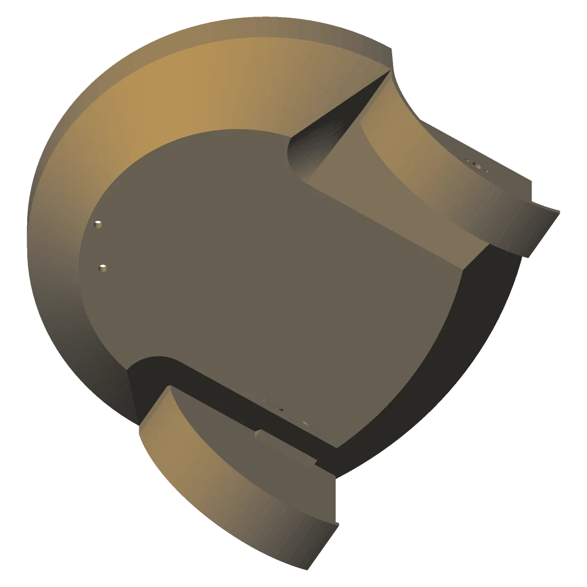
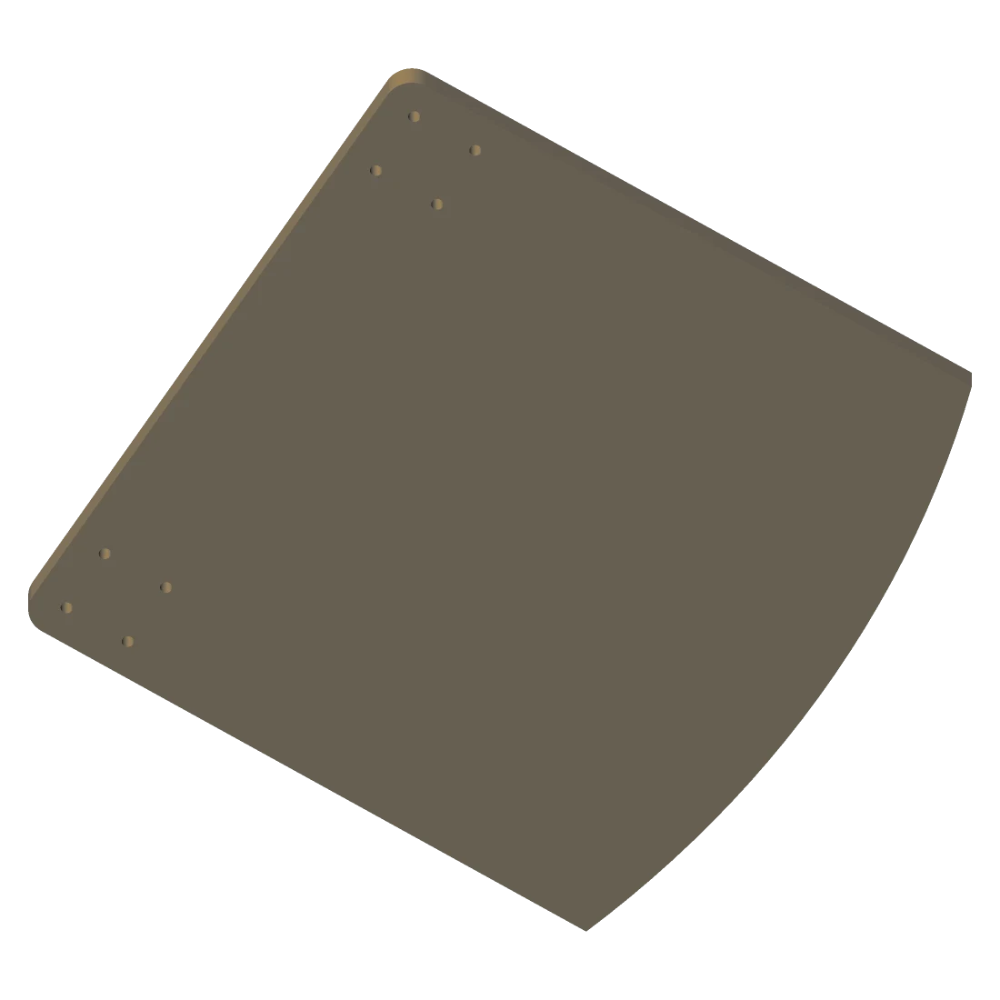
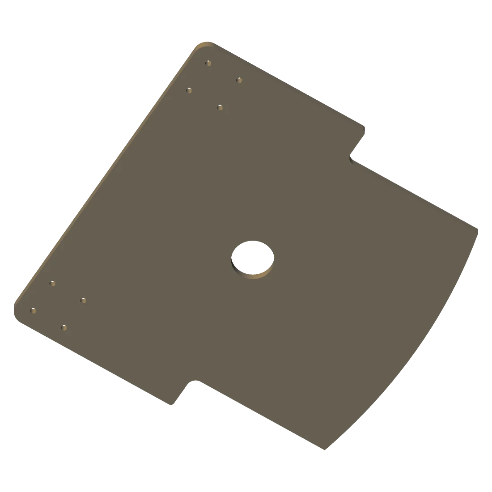
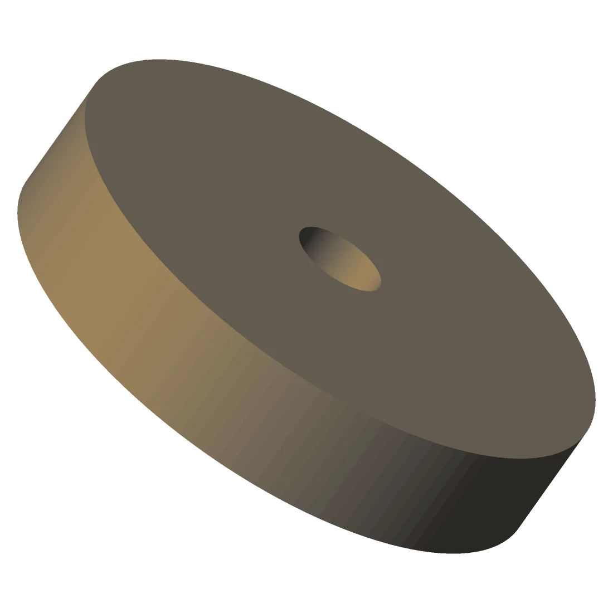
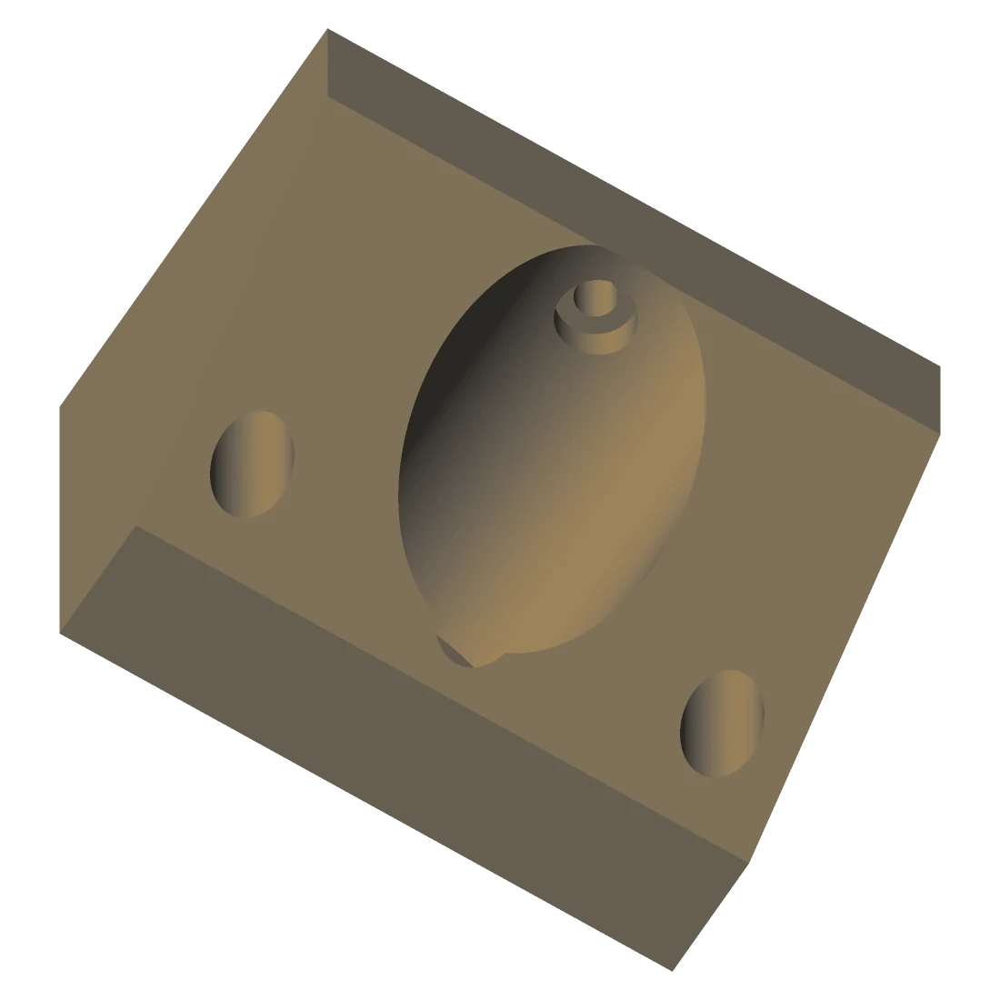
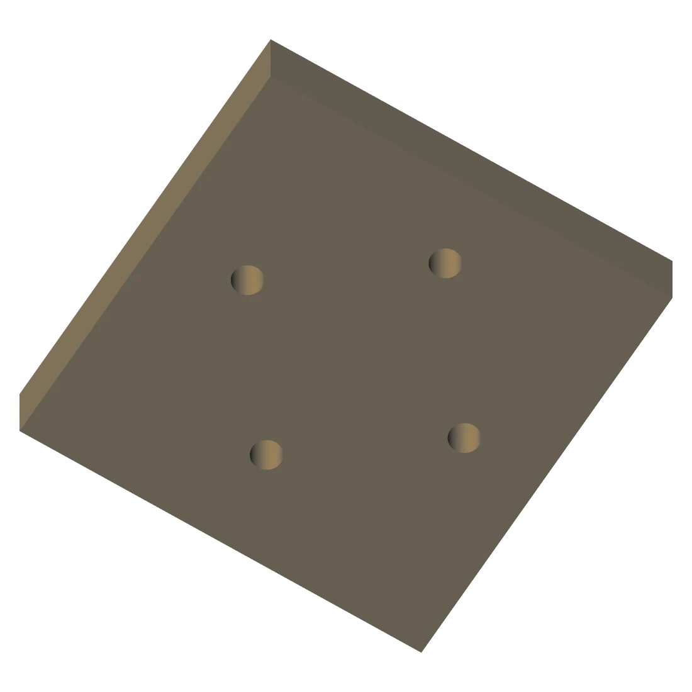
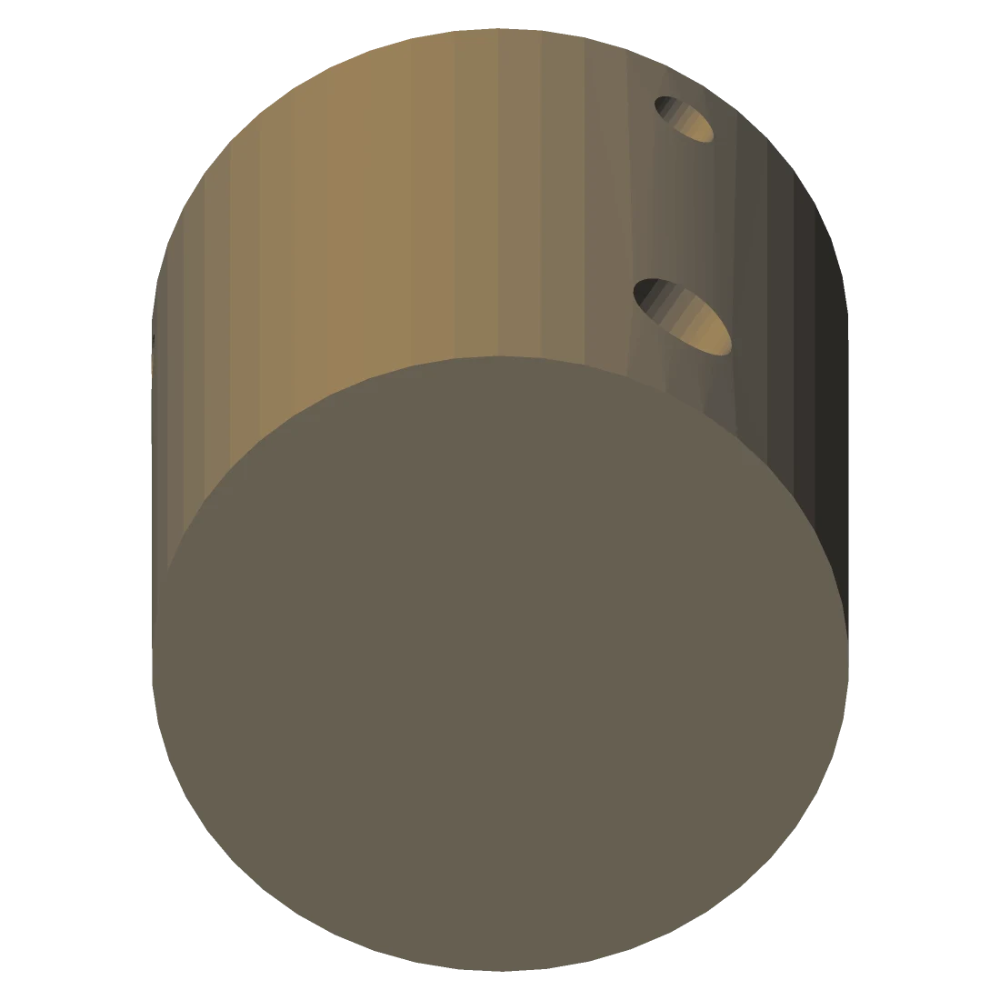

<p align="center">
  
</p>

<h1 align="center">zana</h1>

<p align="center"><strong>Open hardware for the physical world — the devices your hub commands.</strong></p>

<p align="center">
  <a href="#whats-here">What's here</a> ·
  <a href="#the-mower">The mower</a> ·
  <a href="#the-charging-link">Charging link</a> ·
  <a href="#electronics">Electronics</a> ·
  <a href="#build-it">Build it</a> ·
  <a href="#checks">Checks</a>
</p>

<p align="center"><sub>FreeCAD · KiCad · 3D-printable · MIT · <a href="https://github.com/vul-os/aql">runs on Aql</a></sub></p>

<p align="center">
  
</p>

<p align="center">
  <sub>Every render in this README is drawn from a mesh tracked in this repo by
  <a href="site/gen_renders.py"><code>site/gen_renders.py</code></a>, and the dimensions
  are its real bounding box, measured at render time.</sub>
</p>

---

**Zana** (Swahili — *"tools / gear"*) is an open-hardware line for the physical
world: reference designs for the machines a smart home or business actually runs
on — robot mowers, sensor nodes, security and cleaning bots, cameras.

Zana is the **body** to [**Aql**](https://github.com/vul-os/aql)'s brain: every
device is meant to drop straight into Aql, the open-source command center. But
the designs are open and vendor-neutral, so they work with any compatible
control plane. You are not buying into anyone's cloud by printing a wheel.

> [!IMPORTANT]
> **Status: prototype-stage reference designs.** The first device — an
> autonomous **mower** — is here as CAD and PCB work recovered from active
> prototyping, plus one executable engineering study. There is **no firmware in
> this repo**, no bill of materials, and no assembly guide. It is not yet a
> finished, documented, buy-the-parts build. What *is* here is the geometry, the
> boards, and the reasoning behind the charging link.

## What's here

| Area | Contents | State |
|---|---|---|
| **Chassis & body** | FreeCAD bodies across four iterations (`mowbot*.FCStd`), wheels, casting moulds, motor supports | design files |
| **Drivetrain** | Shafts, couplers (including an aluminium variant), GT2 pulley, castor fitting | design files |
| **Electronics** | KiCad projects — `TRANSMITTER` (thru-hole + SMD), `MAINBOARD`, `EMF_SENSOR`, `RAIN`, and the shared `IMRANS_LIBRARY` symbols | design files |
| **Wireless power** | [`mower/coil-study/`](mower/coil-study/README.md) — an inductance and efficiency model for the charging link, in Python | **runs; covered by tests** |
| **Simulator** | [`mower/simulator/`](mower/simulator/README.md) — C++ (raylib + Bullet, native and WASM) and PyBullet sources for driving over grass | **source only — not built, not tested, and it needs a mesh that isn't checked in** |
| **Fabrication rigs** | The coil winder, PCB mill and UV exposure box built to make the electronics | design files |
| **Firmware** | — | **not here** |

## The mower

An autonomous robot mower with an inductive charging dock — so there is no
connector to corrode in wet grass. Four chassis iterations are tracked, and the
older ones are kept deliberately: on a hardware project the design history *is*
the documentation.

| | Part | Size (mm) | Notes |
|---|---|---|---|
|  | **Chassis body** | 380 × 380 × 41 | Iteration 4 — the shell the drivetrain and boards mount into |
|  | **Base plate** | 380 × 380 × 10 | Deck the motors, castor and coil receiver bolt onto |
|  | **Drive wheel** | 190 × 40 × 189.9 | Printed hub and tread, cast in its own printed mould |
|  | **Motor support** | 60 × 42 × 40 | Bracket for the main drive gearmotor |
|  | **Castor fitting** | 90 × 90 × 15 | The front swivel mount |
|  | **Shaft coupler** | 30 × 30 × 30 | Printed, with an aluminium variant for the load path |

Full parts breakdown: [`mower/README.md`](mower/README.md).

**Formats.** `.FCStd` is the FreeCAD source — edit those. `.3mf`/`.stl` are for
slicing, `.step` for any other CAD package, `.dxf`/`.svg` are 2D profiles, and
`.kicad_*` are the boards. FreeCAD and KiCad auto-backups are gitignored.

## The charging link

`mower/coil-study/` models the inductive link from first principles — elliptic
integrals for Maxwell mutual inductance between coaxial loops, AC resistance
with skin and proximity effects, and the *k·Q* efficiency solve — for a 200 mm
coil at 40 kHz across a 40 mm air gap.

| | Option 1 | **Option 2 — chosen** | Option 3 |
|---|---|---|---|
| Configuration | Single layer, 8 T | **2 layers × 8 T** | 2 layers × 29 T |
| Outer diameter | 223.8 mm | **223.8 mm** | 295.2 mm |
| Inductance | 30.78 µH | **118.46 µH** | 1288.56 µH |
| Wire length | 5.33 m | **10.65 m** | 45.12 m |
| Efficiency @ 40 mm | 85.7 % | **91.5 %** | 96.4 % |
| Resonant capacitor | 514.4 nF | **133.6 nF** | 12.3 nF |

Option 2 wins because it is the same 223.8 mm across as the simple coil and only
1.5 mm thick, but buys 5.9 points of efficiency for one extra winding operation.

Those numbers are not decoration. `tests/test_coil_physics.py` parses the
comparison table out of `DESIGN_SUMMARY.md` and re-derives **every cell** from
`physics.py`, then checks the model's own invariants — reciprocity, monotonicity,
efficiency bounds. The write-up and the model cannot drift apart without CI
going red.

## Electronics

Five KiCad projects under `mower/PCB/`:

- **`TRANSMITTER`** — the dock side of the inductive link, in thru-hole and SMD revisions.
- **`MAINBOARD`** — the mower's own board.
- **`EMF_SENSOR`** — boundary-wire pickup, with a panelised DIP version for milling.
- **`RAIN`** — an interdigitated comb electrode. Rain bridges the fingers, conductivity rises, the mower goes home.
- **`IMRANS_LIBRARY`** — the shared symbol library the projects draw from.

These boards were not ordered from a fab. The repo also carries the **coil
winder**, the **PCB mill** and the **UV exposure box** built to produce them —
the part of a hardware project nobody photographs and everybody needs.

## Build it

You will want [FreeCAD](https://www.freecad.org/) for the mechanical design,
[KiCad](https://www.kicad.org/) for the boards, and a 3D printer for the
printable parts.

1. Open the `.FCStd` files in `mower/` — those are the editable sources.
2. Open the KiCad projects in `mower/PCB/`. `EMF_SENSOR_DIP` ships a panelised board and a script for milling it yourself.
3. Slice the `.3mf`/`.stl` meshes. The wheel is cast in its own printed mould rather than printed solid.
4. Expect to fill gaps — there is no firmware, no BOM and no assembly guide here.

## Checks

Most of this repo is CAD and PCB binaries that no CI can meaningfully verify.
What *is* checkable is checked, and
[`.github/workflows/ci.yml`](.github/workflows/ci.yml) runs it on every push:

```sh
pip install -r requirements-dev.txt
python3 -m pytest -q
```

Three gates, each asserting its own coverage count so it cannot pass by doing
nothing:

- **`tests/test_coil_physics.py`** — re-derives every number in the coil write-up from the model, and checks reciprocity, monotonicity and efficiency bounds.
- **`tests/test_repo_integrity.py`** — every path named in a README exists; no tracked file is an empty husk; every shell script parses; every Python file compiles; no home directory leaked into a checked-in export.
- **`tests/test_site.py`** — `site/` fetches nothing off-box, every local path resolves after the copy, the type is vendored, and the landing cannot quote a dimension its mesh does not have.

## The site

`site/` is a self-contained mini-site — no build step, no third-party requests —
collected into vulos.org at `/products/zana`. Its part renders are generated:

```sh
python3 site/gen_renders.py     # → site/assets/renders/*.webp + parts.json
```

That script reads the tracked meshes, projects them orthographically and
z-buffers them into transparent renders, then measures each part's real bounding
box into `parts.json`. `test_site.py` fails if the page ever states a dimension
that disagrees with it, so the captions cannot rot.

## Ecosystem

- **[Aql](https://github.com/vul-os/aql)** — the brain: the open-source command center that discovers and controls your devices.
- **Zana** — the body (this repo): the open hardware Aql commands.

Zana devices work with any compatible control plane, and run best on Aql.

## License

[MIT](LICENSE) — © VulOS. Zana is a VulOS project; source and issues at
[github.com/vul-os/zana](https://github.com/vul-os/zana).

---

<p align="center">
  <a href="https://vulos.org"></a><br>
  <sub><a href="https://vulos.org"><b>vulos</b></a> — open by design</sub>
</p>
